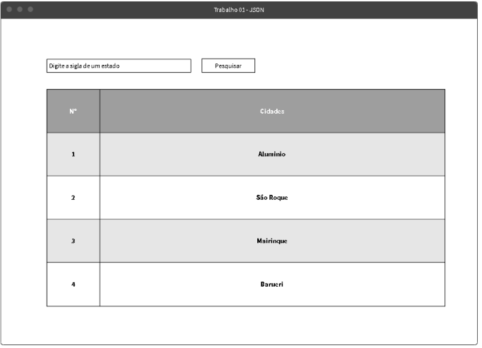

# Esse projeto foi feito como trabalho de Desenvolvimento para servidores na Fatec São Roque

Nesse projeto teremos, uma aplicação simples, renderizada do lado do servidor utilizando PHP no backend, HTML e CSS no frontend. Ele deverá ser executado dentro de um sevidor PHP.

## Funcionalidades realizadas com PHP:

1. A tabela deverá ser preenchida com as cidades correspondentes ao estado. As cidades estão localizadas no arquivo cidades.jon dentro desse projeto.
2. A primeira coluna é uma numeração sequencial.
3. A formatação da tabela deverá ser zebrada conforme o wireframe.

## Entrega

- **Data**: 18/03/2019
- **Local**: OneDrive pasta "04 - Cidades"

## A tabela

